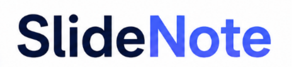

<p align="center">
  
</p>

<h1 align="center">SlideNote</h1>

<p align="center">
  <strong>Coverage-aware course notes from lecture slides</strong>
</p>

<p align="center">
  Turn PPT/PDF into readable, traceable notes with images, OCR/vision, Lecture-Weave writing, and coverage checks.
</p>

<p align="center">
  <em>Not just a slide summarizer, but a faithful study-document pipeline.</em>
</p>

<p align="center">
  
  
  
  
  
</p>

<p align="center">
  <a href="README.md">English</a> |
  <a href="README.zh-CN.md">中文</a> |
  <a href="docs/index.zh-CN.md">Docs</a> |
  <a href="CONFIG.zh-CN.md">Config</a> |
  <a href="ROADMAP.zh-CN.md">Roadmap</a>
</p>

---

## Contents

- [Quick Start](#quick-start)
- [Modes and Pipeline](#modes-and-pipeline)
- [Outputs and Review](#outputs-and-review)
- [Optional GUI](#optional-gui)
- [Textbook Chunks](#textbook-chunks)
- [Origin](#origin)
- [Setup and Docs](#setup-and-docs)
- [License](#license)
- [Acknowledgements](#acknowledgements)

## Quick Start

On Windows / PowerShell:

```powershell
git clone https://github.com/Cat-blizzard/SlideNote.git
cd SlideNote
.\install.ps1
.\run_gui.ps1
```

The installer creates `.venv`, installs GUI and model dependencies, and checks the environment. You can enter API keys in the GUI for a single run. Start with a local preview to check extraction and note generation:

```powershell
python -m slidenote build path\to\lecture.pdf --out outputs\local --preset local --export markdown-zip
```

For model-assisted writing and visual understanding, configure the relevant API keys. For example, with DeepSeek for text and the default vision provider:

```powershell
$env:DEEPSEEK_API_KEY="..."
$env:DASHSCOPE_API_KEY="..."
python -m slidenote build path\to\lecture.pdf --out outputs\lecture --provider deepseek --export markdown-zip
```

The main output is `outputs\lecture\notes.md`. Check generated explanations against the slides.

For manual setup, use `python -m pip install -e "."` for local mode or `python -m pip install -e ".[llm]"` for model mode. `.\run_gui.ps1` installs the GUI extra when needed. The `dev` extra is mainly for project tests.

## Modes and Pipeline

| Mode | Use | Behavior |
| --- | --- | --- |
| Default `lecture` | Model-assisted detailed study notes | Uses a text model and, as configured, OCR, visual understanding, and Lecture-Weave writing. Quality depends on the source and model output. |
| `local` | Offline preview and extraction checks | Makes no text, vision, or OCR API calls; local rules produce basic notes. |

`--vision off` disables visual model calls; it does not prevent images from appearing in notes or exports. Use `--ocr off|auto|all` to adjust OCR. See [configuration](CONFIG.zh-CN.md) for options and presets.

```text
Ingest -> Understand -> Write -> Guard -> Export
```

| Stage | Main work | Main artifacts |
| --- | --- | --- |
| **Ingest** | Parse PPT/PDF and extract pages, screenshots, and image assets. | Pages and assets for later stages |
| **Understand** | Run OCR, visual and structural understanding, and assemble structured content. | `content.json`, `deck_understanding.json`, `page_understanding.json`; `content_guard.json` when configured |
| **Write** | Generate readable study notes. | `notes.md` |
| **Guard** | Build source mappings, coverage reports, and quality diagnostics. | Final `element_ir.json`, `source_map.json`, `coverage.json`, `coverage.md`, `quality_report.json` |
| **Export** | Produce requested sharing or reading formats. | `notes.zip`, `notes.docx`, `notes.pdf`, and others |

See the [pipeline guide](docs/pipeline.zh-CN.md) for implementation details.

## Outputs and Review

`notes.md` is the main output. With `--export markdown-zip`, SlideNote writes `notes.zip` containing the notes; it includes files from `notes.assets/` when images are referenced. Word and PDF export require external tools; see [configuration](CONFIG.zh-CN.md). Generate review and exam materials separately after a build:

```powershell
python -m slidenote study-pack outputs\lecture --question-count 20
```

Coverage uses element IDs and text markers to flag potentially missing source items. Quality scores are mostly heuristic diagnostics. Neither proves factual accuracy, completeness, or question validity. Before sharing notes, compare important claims, figure placement, equations, tables, and exported layout with the source slides.

## Optional GUI

SlideNote Studio lets you upload PPT/PDF, enter temporary API keys, select a mode, view progress and reports, inspect page screenshots and notes, and download outputs:

```powershell
.\run_gui.ps1
```

See the [GUI guide](gui/README_GUI.md).

## Textbook Chunks

`textbook-index` turns a PDF textbook into a chunked corpus with table-of-contents and section mapping for future retrieval features. It currently creates no vector index, provides no search, and does not feed note generation.

```powershell
python -m slidenote textbook-index path\to\textbook.pdf --out outputs\textbook --ocr auto
```

For a digital PDF with selectable text, try `--ocr off`. The `auto` setting uses OCR on scanned or low-text pages.

## Origin

I learn more comfortably by reading and revisiting material at my own pace. Lecture slides, however, are often prompts for a live explanation: the logic is scattered, and important details may be in figures, tables, formulas, or what the teacher says. Rewriting them into notes after class takes time and can miss details.

SlideNote grew from the idea of turning slides into structured study notes that preserve images and links to their source pages, with coverage reports that point to material worth checking. The aim is to make courseware easier to read and review while keeping the original material available for verification.

## Setup and Docs

SlideNote needs Python 3.10 or newer. Local mode needs no GPU. LibreOffice or PowerPoint may be needed for slide conversion and full-page screenshots; Pandoc and LibreOffice may be needed for Word, PDF, or LaTeX exports. The setup scripts above target Windows; Linux/macOS users can call the same `python -m slidenote ...` commands.

See the [documentation index](docs/index.zh-CN.md), [configuration](CONFIG.zh-CN.md), and [roadmap](ROADMAP.zh-CN.md). The detailed docs are currently Chinese-first. The longer-term aim is a traceable workflow across slides, textbooks, review questions, and personal notes; the roadmap tracks actual priorities.

## License

SlideNote uses a dual-license structure:

- Source code is licensed under the GNU Affero General Public License v3.0 or later (`AGPL-3.0-or-later`). See [LICENSE](LICENSE).
- Documentation and example educational materials are licensed under Creative Commons Attribution 4.0 International (`CC BY 4.0`). See [LICENSES/CC-BY-4.0.txt](LICENSES/CC-BY-4.0.txt).

We chose AGPL because SlideNote's core value is not a thin wrapper around one model. It is the courseware parsing, visual understanding, figure handling, note generation, and study-pack workflow around it. We want that capability to stay open: anyone can use, study, modify, and improve SlideNote, but if someone distributes a modified version or offers a modified version as a network service, the corresponding source code should also be available to users and the community.

AGPL does not prohibit commercial use, nor does it restrict students, teachers, or teams from running SlideNote locally. Its main requirement is source availability when modified versions are distributed or provided as network services. Notes, study materials, and other outputs generated by users are not automatically licensed under AGPL just because they were produced with SlideNote.

The SlideNote name, logo, and other brand assets are not licensed for standalone reuse. See [NOTICE](NOTICE) for the exact scope.

## Acknowledgements

- SlideNote's optional review/exam study-pack workflow was conceptually inspired by [WUBING2023/ExamPass-Assistant](https://github.com/WUBING2023/ExamPass-Assistant) and the extended [MIKUZ12/ExamPass-Assistant](https://github.com/MIKUZ12/ExamPass-Assistant) fork. SlideNote does not reuse their code, templates, prompts, or assets.
- GUI development contributions from [hongzuoj-pixel](https://github.com/hongzuoj-pixel).
- Testing contributions from [MOm0-000](https://github.com/MOm0-000).
- SlideNote's parser-adapter and document-IR roadmap is informed by prior art such as [Microsoft MarkItDown](https://github.com/microsoft/markitdown), [Docling](https://github.com/docling-project/docling), [Marker](https://github.com/datalab-to/marker), [MinerU](https://github.com/opendatalab/MinerU), and [Unstructured](https://github.com/Unstructured-IO/unstructured).
- SlideNote's future retrieval, source tracing, and post-generation QA direction is informed by systems such as [RAGFlow](https://github.com/infiniflow/ragflow). These projects are references and inspirations, not bundled dependencies unless explicitly listed elsewhere.
- Thanks to [LEO690201](https://github.com/LEO690201) for contributing bug fixes that improved SlideNote's reliability.
- SlideNote's development has also benefited from code analysis, implementation, and debugging assistance provided by Codex, Claude Code, and DeepSeek Harness. All AI-assisted changes remain subject to maintainer review and project testing.

## Awards

SlideNote received the **Excellence Award (优秀奖)** in the University of Science and Technology of China's 2026 “一〇七” Cup Computing Power and AI Agent Development Competition (算力与智能体开发大赛). The award certificate was issued by the university's Academic Affairs Office and Network Information Center in September 2026.
